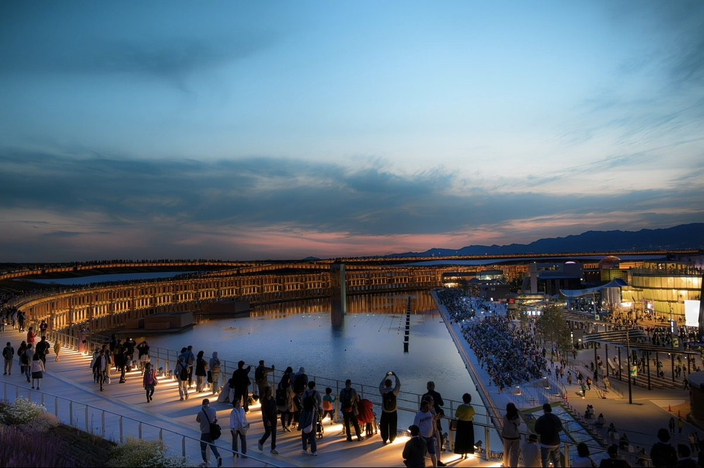

# aeva — ランディングページ

JavaScript なし・HTML / CSS のみ。画像はすべて外部ファイル参照です。

## ファイル構成

```
aeva-site/
├─ index.html      ← ページ本体（読みやすい素のHTML）
├─ styles.css      ← トークン・共通スタイル・プレースホルダ枠
├─ sections.css    ← 各セクション／部品のスタイル
└─ images/         ← ここに写真を置く（下記の名前で）
   ├─ logo.png            ロゴ（青→オレンジのアーチ）
   ├─ hero.jpg            ヒーローのメインビジュアル
   └─ works/
      ├─ travel-01.jpg     travel-02.jpg
      ├─ wildlife-01.jpg   wildlife-02.jpg   wildlife-03.jpg
      ├─ landscape-01.jpg  landscape-02.jpg
      └─ city-01.jpg       city-02.jpg
```

## 写真の入れ方

各プレースホルダ枠は HTML 内で次のように書かれています：

```html
<div class="ph ph--wide"><span class="ph__label"><b>images/works/travel-01.jpg</b></span></div>
```

写真ができたら、その枠を `` に置き換えるだけです：

```html

```

`ph--wide`（横長 3:2）/ `ph--tall`（縦長 4:5）/ `ph--hero`（16:10）は
そのまま使えるので、比率を保ったまま差し替えられます。

ロゴ（`images/logo.png`）を置くと、ヘッダー・ヒーロー・フッターに自動で表示されます。

## フォント
Google Fonts（Inter / Zen Kaku Gothic New）を読み込んでいます。
完全オフラインにしたい場合は `index.html` の `<link ... fonts>` 2行を削除してください。
